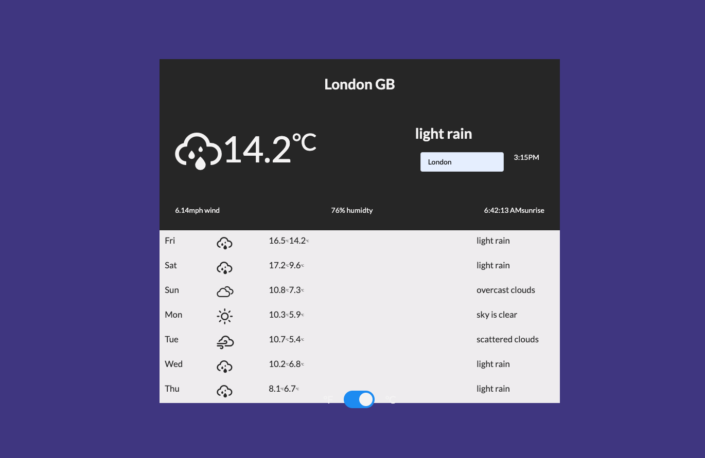

# Apollo Weather app
> Weather app created using Apollo client and Apollo Server with GraphQL

## Screenshot

## Tools
* React
* Apollo Client & Apollo Server
* GraphQL
* Styled Components

## Todo
- [ ]  Improve the Styling of the UI - currently using flexbox and basic CSS styling - however there are some errors with styling (as seen in the screenshot)
- [ ]  Add Error handling for GraphQL queries
